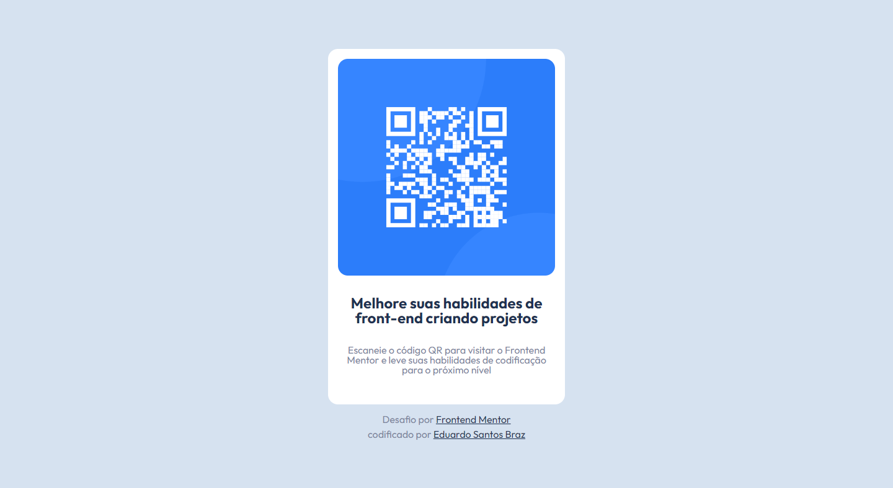

# Frontend Mentor - QR code Solução

Esta é uma solução para o [desafio do componente de código QR no Frontend Mentor](https://www.frontendmentor.io/challenges/qr-code-component-iux_sIO_H). Os desafios do Frontend Mentor ajudam você a melhorar suas habilidades de codificação criando projetos realistas.

## Índice

- [Visao geral](#visao-Geral)
  - [Screenshot](#screenshot)
  - [Links](#links)
- [Meu processo](#meu-processo)
  - [Construido com](#Construido-com)
  - [recursos uteis](#recursos-uteis)
- [Autor](#autor)

## Visao geral

### Screenshot

### Links

- Repositorio URL: [https://github.com/EduardoBraz1/QR-code](https://github.com/EduardoBraz1/QR-code)
- Deploy URL: [Add live site URL here](https://your-live-site-url.com)

## Meu processo

### Construido com

- Marcação HTML5 semântica
- Propriedades personalizadas do CSS
- Flexbox
- SCSS/SASS
- Mobile-first
- BEM

### recursos uteis

- [Flexbox guide](https://css-tricks.com/wp-content/uploads/2022/02/css-flexbox-poster.png) - Isso me ajudou para conseguir alinhar os itens da forma correta
- [BEM documentação](https://getbem.com/introduction/) - Isso me ajudou a relembrar e praticar o melhor metodo para colocar classe em um elemento HTML.

## Autor

- Github - [@EduardoBraz1](https://github.com/EduardoBraz1)
- Frontend Mentor - [@EduardoBraz1](https://www.frontendmentor.io/profile/EduardoBraz1)
- Linkedin - [Eduardo Santos Braz](https://www.linkedin.com/in/eduardo-s-8b0210161/)
